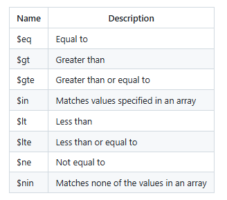

# MongoDB
MongoDB is a popular NoSQL document-oriented database management system, known for its flexibility, high performance, high availability, and multi-storage engines. Unlike traditional relational databases (RDBMS), MongoDB does not store data in tables and rows but instead uses a document-based structure with BSON (Binary JSON) format

# collections and documents in MongoDB
A collection is a grouping of MongoDB documents. Documents within a collection can have different fields. A collection is the equivalent of a table in a relational database system.

# MongoDB Architecture


MongoDB's architecture consists of several core components that work together to provide efficient data storage, retrieval and processing.
## Replica Sets
A replica set is a group of mongod instances that maintain the same data set. A replica set contains several data bearing nodes and optionally one arbiter node. Of the data bearing nodes, one and only one member is deemed the primary node, while the other nodes are deemed secondary nodes.

Replica sets offer high availability, fault tolerance, and improved read capacity through data redundancy. However, they also introduce complexity in setup and maintenance, potential performance bottlenecks with replication lag, and increased storage and resource requirements

## Sharding
Sharding is a method for distributing data across multiple machines.
MongoDB uses sharding to support deployments with very large data sets and high throughput operations. Database systems with large data sets or high throughput applications can challenge the capacity of a single server.
For example, high query rates can exhaust the CPU capacity of the server. Working set sizes larger than the system's RAM stress the I/O capacity of disk drives.

The Advantages of using Sharding include improved performance and scalability, especially for large datasets and high-volume workloads. However, sharding also introduces complexities in application development, query management, and data consistency, potentially increasing maintenance costs
# MongoDB Use Cases
1. Customer service applications: MongoDB is used in customer service applications to manage and analyze unstructured data from various sources. Its scalability and flexible schema design enable the creation of responsive and efficient customer service platforms. For example, eBay uses MongoDB to store and manage customer interactions, enhancing their service quality.
2. Content management systems: MongoDB is widely used in content management systems (CMS) because it handles various data types and formats. Its JSON-like BSON format allows for easy storage and retrieval of multimedia content, making it a preferred choice for CMS platforms. For example, The New York Times uses MongoDB to manage its vast articles and multimedia content archive.
# Notes
# MongoDB syntaxes
#### Switches the current database context to spartadb
``` 
use spartadb
``` 
#### explicitly create a new collection named "academy" in the current database.

``` 
db.createCollection("academy")
```
#### inserts a single document into the academy collection in the current database.
```
db.academy.insertOne({name:"New document"})
```
#### inserts multiple documents into the academy collection in one operation.
```
db.academy.insertMany([{"course":"Data Engineering", "length":10}, {"course":"Data Analysis", "length":8}])
```
```
db.academy.insertMany([{"first_name":"Xavier"}, {"sur_name":"Francis"}, {"stream":"data_engineering"}, {"course_id":504}, {"Trainer":"Luke"}])
```
# Data Modelling in MongoDB
There are two kind of main ways  we can do data modeling in MongoDB in particular, embedding and Referencing
## Embedding
Embedding is a fairly simple concept in MongoDB.It involves placing sub-documents inside a larger document — essentially, documents within documents. This technique is known as embedding related documents.Embedding is especially suitable for one-to-one and one-to-many relationships. While this might not always be the perfect approach for every use case, it's often the preferred method when normalization isn’t necessary.For example, let’s consider a training course. You can embed related information, such as modules or lessons, directly inside the course document. We’ll look at that example in a moment.

### An example of embedding
```
db.academy.insertOne({
  name:"David",
  course:"Data Engineering",
  trainer:{name:"Luke", expertise:"Data"}
})
```

## Referencing
Referencing is another way to establish relationships between documents in MongoDB.This approach is more suitable for normalized data because it uses some kind of ID to connect documents.Unlike embedding, where you store a document inside another document (resulting in just one document), referencing involves keeping documents separate and linking them by reference. For example, you might reference a user document in a contact document or an access document.Referencing helps avoid data duplication and reduces redundancy, which is useful for maintaining consistency. However, it comes with a trade-off: lower read performance, since the database may need to perform multiple queries to fetch related data.That said, if you're dealing with many-to-many relationships, referencing is usually the only practical solution.
 
#### explicitly create a new collection called "students" in the current database.
```
db.createCollection("students")
```
#### command that inserts a single document into the students collection.
```
db.students.insertOne(
  {
    name:"Mr S. Global",
    year: NumberInt(2020),
    score: 88.2,
    course: "Data",
    address: {
      city: "Birmingham",
    }
  }
)
```
#### list all collections in the currently selected database.
```
show collections
```
#### return an array of all collection names in the current database.
```
db.getCollectionNames()
```
#### query that retrieves all documents from the students collection.
```
db.students.find({})
```
```
db.academy.find({})
```
## working with a database called 'starwars' database and collection  called 'characters'
#### initiating the database by using 'use databasenaeme'
```
use starwars
```
## Find out information
### listing all the information related to character 'name'
```
db.characters.find({name: "Ackbar"})
```
### format the output of a query so it's easier for humans to read
```
db.characters.find({name: "Ackbar"}).pretty
```
### if you need specific information from a charcater
```
db.characters.find({name: "Chewbacca"}, {name:1, eye_color:1})
```
### To remove id number
```
db.characters.find({name: "Chewbacca"}, {_id:0, name:1, eye_color:1})
```
### To get information from an embedded document (document insiside a document)
```
db.characters.find({name: "Ackbar"}, {_id:0, name:1, "species.name":1})
```
### To  find out the 'homeworld name of all the characters who's species name is "Human"
```
db.characters.find(
  {
  "species.name" : "Human"
  },
  {name:1,
   "species.name": 1,
   "homeworld.name": 1,
   _id:0
  }
)
```
## Filtering based on value
### Filter the data based on the eye color using $in and write the name and eye color of the character 
```
db.characters.find(
  {
    eye_color:{
      $in:["yellow", "orange"]
    }
  },
  {
    name: 1,
    eye_color: 1
  }
)
```
### female characters with blue eye
```
db.characters.find(
  {
    gender: "female",
    eye_color: "blue"
  },
  {_id: 0,
   name: 1,
   gender: 1,
   eye_color: 1
  }
)
```
### Male characters with red eye
```
db.characters.find(
  {
    gender: "male",
    eye_color: "red"
  },
  {_id: 0,
   name: 1,
   gender: 1,
   eye_color: 1
  }
```
### Usage of '$and:[]' to get all female characters with blue eyes
```
db.characters.find(
  {
    $and:[
      {eye_color: "blue"},
      {gender: "female"}
    ]
  },
  {
    _id: 0,
    name: 1,
    gender: 1,
    eye_color: 1
  }
)
```
### Usage of $or:[] to get all character who are female or with blue eyes
```
db.characters.find(
  {
    $or:[
      {eye_color: "blue"},
      {gender: "female"}
    ]
  },
  {
    _id: 0,
    name: 1,
    gender: 1,
    eye_color: 1
  }
)
```
## Comparison operators
 
opearors_mongo.png
### Find out all the characters whose heights are greater than 200
```
db.characters.find(
  {height:{$gt:200}},
  {_id: 0,
   name: 1,
   height: 1
  }
)
```
## Aggregate
Aggregation in MongoDB works based on a pipeline. It's basically done in multiple stages, similar to how we've been running multiple queries to reach a final result.
For example, we might first select documents that match certain criteria, and then transform them to produce the aggregated result. Each stage of the pipeline is provided as an element in an array to the .aggregate() method. So, it's similar to what we've been doing — but instead of chaining queries, we'll use .aggregate() and pass in the different stages of the aggregation process.
### Total height of all humans in the starwars characters
```
db.characters.aggregate([
  {$match: {"species.name": "Human"}},
  {$group: {_id: null, total: {$sum:"$height"}}}
])
```
### Total height of all male and female in the starwars characters
```
db.characters.aggregate([
  {$match: {"species.name": "Human"}},
  {$group: {_id: "$gender", total: {$sum:"$height"}}}
])
```
### Find maximum height from homeworld
```
db.characters.aggregate([
  {$group: {_id:"homeworld.name", max:{$max:"$height"}}}
])
```
### Single purpose Aggregation
single-purpose aggregation refers to the idea that some types of aggregation don’t actually require the .aggregate() method. In some cases, you can just call specific methods directly. If you need to perform more complex operations, you’d use .aggregate(), but for simpler tasks like getting distinct values or counts, you can use built-in methods.
For example: db.characters.distinct("fieldName").
### Find distinct species name
```
db.characters.distinct("species.name")
```
### Total number of Human species
```
db.characters.count({"species.name": "Human"})
```
### Average mass and species count
```
db.characters.aggregate([
  {
    $group: {
      _id: "$species.name",
      avg: {$avg: "$mass"},
      count: {$sum: 1}
    }
  }
]).toArray(
```
### Avg mass and species count, no nulls and ascending:
```
db.characters.aggregate([
  {
    $group: {
      _id: "$species.name",
      avg: {$avg: "$mass"},
      count: {$sum: 1}
    }
  }, { $match: {avg: {$ne: null}}},
  {$sort: {avg: 1}}
]).toArray(
```
More on aggregate function can be found here
https://docs.mongodb.com/manual/reference/operator/aggregation/#accumulators-group
## Referencing
When working with MongoDB, you have two options for modeling related data: embedded documents or references.
What we’re going to do now is quickly explore how to create and use manual references in MongoDB.
Specifically, we'll add some starships and assign a reference to the people (characters) associated with them.
We'll store these references in the starships collection by referencing objects from the characters collection.
So first, we’ll start with Darth Vader. To do that, we’ll need to find his ObjectId, since we’re going to reference it in our new document.
### get object_id
```
db.characters.find({name: "Darth Vader"}, {_id:1})
```
### create a collection called "starships"
```
db.createCollection("starships")
```
### insert a document to startships with the same object id
```
db.starships.insertOne({
  name: "TIE Advanced x1",
  model: "Twin Ion Engine Advanced x1",
  manufacturer: "Sienar Fleet Systems",
  length: 9.2,
  max_atmosphering_speed: 1200,
  crew: 1,passengers: 0,
  pilot: ObjectId("6889b19ac92717b013906ea1")})
```
So, we can use the $lookup stage within an aggregation pipeline to perform a join — for example, to add a field from related data in another collection.
```
db.starships.aggregate([
  {$lookup: {
    from: "characters",
    localField: "pilot",
    foreignField: "_id",
    as: "matched_pilot"
  }}
])
```
Let's add another starship just to demonstrate how this works. So, the previous example had just one reference — that was Darth Vader’s starship, which had a single pilot. Now, let’s look at the Millennium Falcon, a ship that has multiple pilots — multiple people use that ship. This is just to demonstrate that referencing multiple documents is also possible.
```
db.characters.find(
  {name: {$in: ["Chewbacca", "Han Solo", "Lando Calrissian", "Nien Nunb"]}}, 
  {_id: 1})
```
```
db.starships.insertOne({
  name: "Millenium Falcon",
  model: "YT-1300 Light Freighter",
  manufacturer: "Corellian Engineering Corporation",
  length: 34.37,
  max_atmosphering_speed: 1050,
  crew: 4,
  passengers: 6,
  pilot: [ObjectId("68889775331e364b163e41be"),ObjectId("68889775331e364b163e41e3"),ObjectId("68889775331e364b163e41f5"),ObjectId("68889775331e364b163e41ff")]})
```
```
db.starships.aggregate([
  {$lookup: {
    from: "characters",
    localField: "pilot",
    foreignField: "_id",
    as: "matched_pilot"
  }}
])
```
```
db.starships.aggregate([
  {$lookup: {
    from: "characters",
    localField: "pilot",
    foreignField: "_id",
    as: "matched_pilot"
  }},
  {$project:{name: 1, model: 1, "matched_pilot.name": 1}}
])
```

